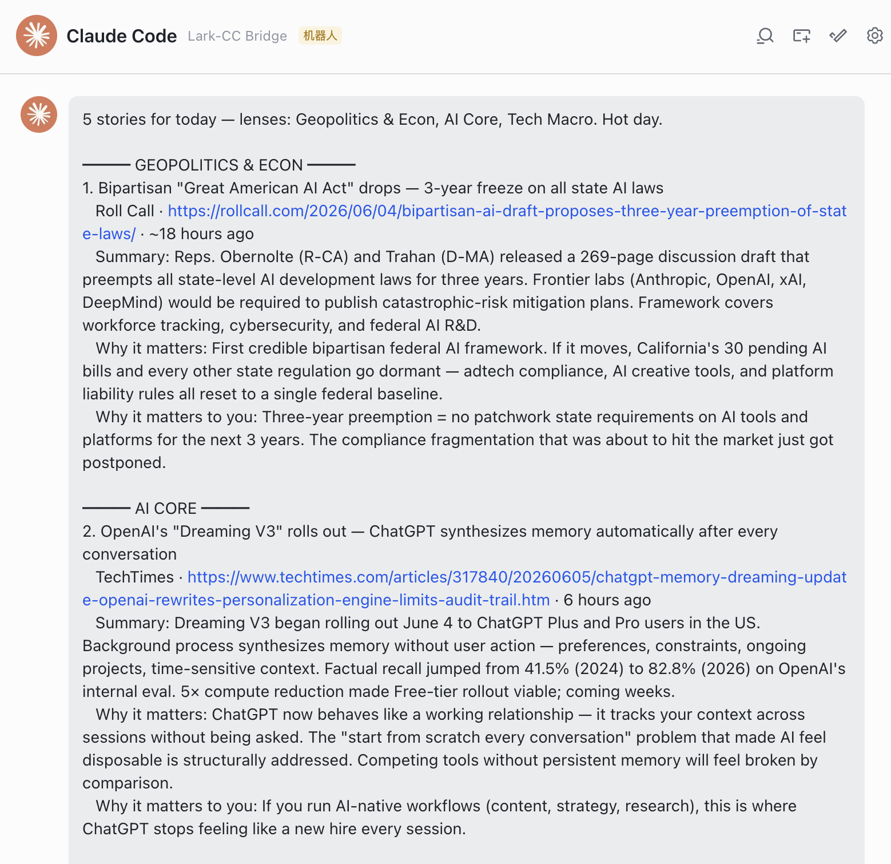

# Examples

What a finished brief looks like, so you can decide if it's worth setting up.

- [`sample-brief.md`](sample-brief.md) — English sample
- [`sample-brief.zh-CN.md`](sample-brief.zh-CN.md) — 中文示例
- `lark-dm.png` — a real brief delivered as a Lark DM (below)

### Lark DM — a real brief

The brief arrives as a bot DM (here via the [Lark bridge](https://github.com/cindyxu1030/lark-agents-bridge)):

> To make your own: run the brief once with `delivery: lark`, screenshot the DM, blur anything private, and replace `examples/lark-dm.png`.
